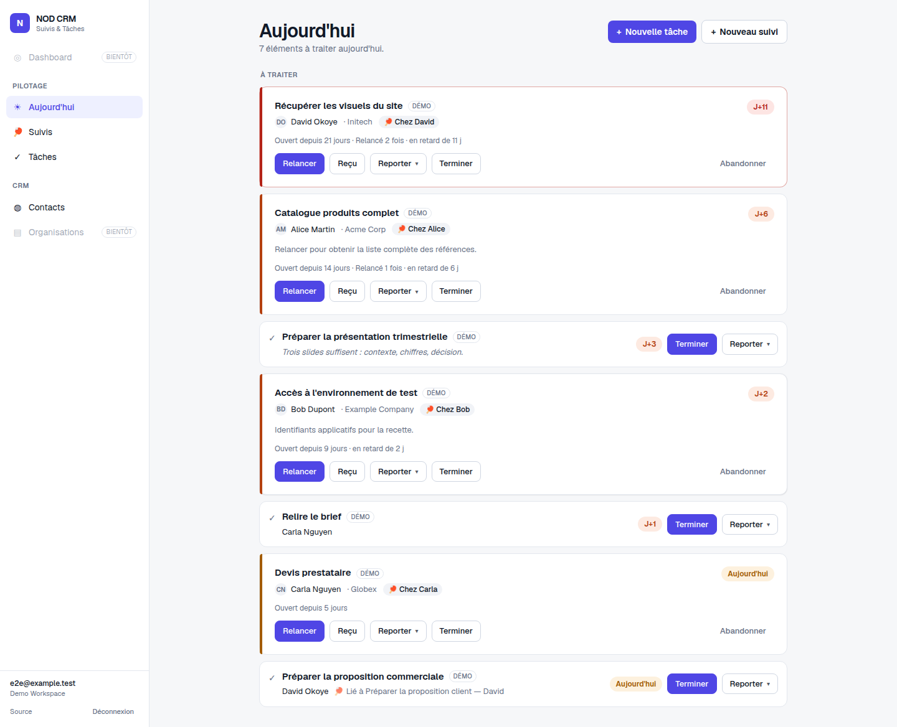
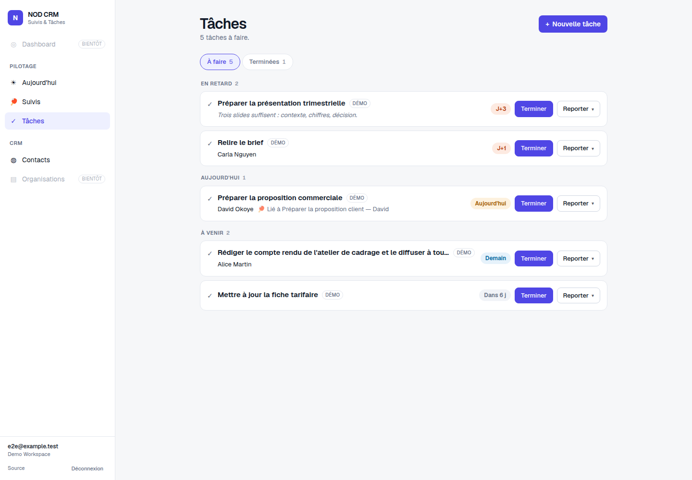
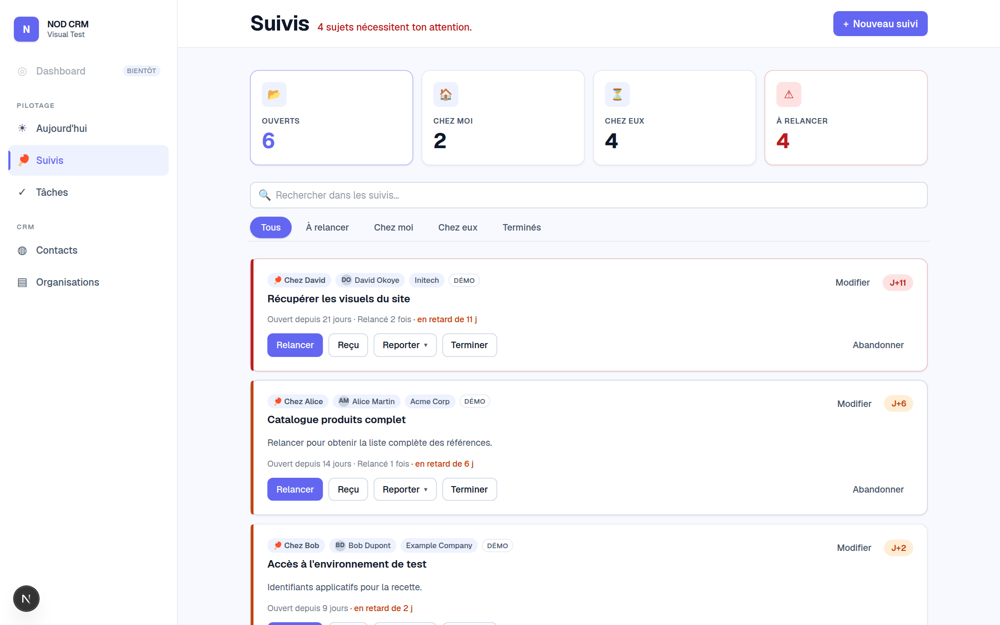

# NOD CRM

[](https://github.com/ious2944/nod-crm/actions/workflows/ci.yml)
[](https://github.com/ious2944/nod-crm/releases)
[](LICENSE)


**Open-source self-hosted CRM focused on follow-ups.**

Most CRMs answer "who are my customers?". NOD CRM answers a smaller, more
urgent question:

> **Who should I follow up with today?**

You create a follow-up, you wait, you nudge, the ball goes back to them, you
close it. That is the whole product. There are no pipelines, no scoring, no
forty-field contact forms — and there is no plan to add them.

Since V0.4 it also answers the smaller question next to it — *what do I have to
do?* — with tasks. Since V0.5 it adds a third dimension: *who are these people,
and what do I need to do with their organisation?* The three objects are
deliberately separate:

> **A task is something to do. A follow-up is something to move forward with
> someone.**

The metaphor is table tennis: 🏓 the ball is either **on your side** or **on
theirs**. Everything on screen exists to make the next action obvious.

> ⚠️ **V0.5.** Four modules — Follow-Up, Contacts, Tasks and Organisations. They
> work and are used in production, but it is a young project — read
> [Limitations](#limitations) before you commit to it. The user interface is
> currently in French only; the documentation is in English and
> internationalisation is on the roadmap.

---

## Philosophy

- **Simplicity.** A feature is not accepted because another CRM has it. It has
  to solve a real problem without making the product harder to understand.
- **Self-hosting.** One database, one application, no queue, no cache, no
  third-party service. It runs on the smallest VPS you have.
- **Ownership of your data.** Self-hosting means administrators decide where
  application data lives and who can reach it.
- **Follow-up workflows.** The next action is the product. Everything else is
  supporting cast.
- **No hidden telemetry.** NOD CRM sends nothing anywhere. No analytics, no
  phone-home, no opt-out needed because there is nothing to opt out of.

---

## Features (V0.5)

Only what actually exists today:

- **Organisations** — a dedicated module at `/organizations`, with creation,
  editing and archiving. Each organisation can store name, website, email, phone
  and notes. The organisation sheet shows all linked contacts, open follow-ups
  and open tasks at a glance.
- **Contacts** — a dedicated directory at `/contacts`, with creation, viewing
  and editing. Each contact can store first and last name, organisation (linked
  via a picker to the Organisations module), job title, email, phone, free-form
  notes and an optional photo. A contact exists independently and does not need
  to be linked to a follow-up.
- **Contact search and filters** — one search box across name, email, phone,
  job title and organisation, executed by PostgreSQL; filters by organisation
  and follow-up state; four sort orders; server-side pagination. The list also
  shows the number of active follow-ups for each contact.
- **Contact sheet** — everything about a person on one page, including their
  linked follow-ups and a button to create a new follow-up with that contact
  already selected.
- **Archiving** — contacts are archived rather than destroyed and can be
  restored. Archiving a contact never deletes or detaches its existing
  follow-ups; historical follow-ups keep the contact and mark it as archived.
- **Follow-ups** — subject, optional context, due date, ball owner, and an
  optional contact selected from the central Contacts directory. New follow-ups
  cannot be attached to an archived contact.
- **Due dates** with day-level reasoning in a configurable time zone, and a
  five-level visual ageing scale (upcoming → tomorrow → today → overdue →
  7+ days late).
- **Status** — open, completed, abandoned.
- **Quick actions** — Nudge, Received, Ball sent, Snooze (+1 d / +3 d / +1 w),
  Complete, Abandon, Reopen.
- **Filters** — All / To nudge / My court / Their court / Completed.
- **Tasks** — a title, a due date, and two states: to do or done. Optionally a
  contact and a linked follow-up, both for context only: no ball, no nudge, and
  **no state is ever synchronised** between a task and a follow-up. The list at
  `/tasks` orders them overdue → today → upcoming, with Complete and Snooze on
  each row and completed tasks one tab away. See
  [docs/tasks.md](docs/tasks.md).
- **Today cockpit** (`/today`) — the V0.3 cockpit, extended in V0.4 with tasks.
  Greets you by name, shows the date, and displays four follow-up attention
  indicators (late / today / upcoming / waiting). The main column shows the
  priority follow-up feed (late + today + stagnant) followed by unfinished
  tasks due today or earlier. The side column shows upcoming and waiting
  follow-ups unchanged. Completing or snoozing either kind updates the page
  immediately without touching the other object.
- **Authentication** — email and password, Argon2id, server-side sessions with
  absolute and idle expiry, rate limiting.
- **Admin CLI** — create workspaces and users, reset passwords, disable
  accounts. Passwords are always typed interactively, never passed as
  arguments.
- **Self-hosting** — Docker Compose, PostgreSQL 16, migrations applied
  automatically at startup.
- **Demo data** — a seed of fictional contacts, follow-ups and tasks, flagged
  in the UI so it can never be confused with real data.

Not built yet, and deliberately shown as disabled in the navigation: Dashboard.

---

## Screenshots



The "Aujourd'hui" cockpit (V0.3, extended in V0.4) answers one question: what needs action now? It greets you by name, shows four follow-up attention indicators, a priority follow-up feed, and — added in V0.4 — a task section for anything due today or overdue. Follow-ups and tasks each keep their own shape; neither replaces the other.



The task list stays a list: overdue, today, upcoming, one line each, Complete and Snooze within reach.



The Follow-Up board keeps the next action visible: what needs your attention, what's on your side, and what's on theirs.

---

## Quick start

You need [Docker](https://docs.docker.com/get-docker/) with the Compose plugin,
and `openssl` (present on every mainstream Linux and macOS).

```bash
git clone https://github.com/ious2944/nod-crm.git
cd nod-crm
./scripts/init-env.sh        # writes .env with freshly generated secrets
docker compose up -d
```

That builds the image, starts PostgreSQL, applies the migrations and starts the
application on <http://localhost:3000>.

`init-env.sh` is a convenience, not a requirement — `cp .env.example .env` and
editing the two secrets by hand does the same thing. Generate them with:

```bash
openssl rand -base64 48                              # AUTH_SECRET
openssl rand -base64 36 | tr -d '/+=' | cut -c1-40   # POSTGRES_PASSWORD
```

### Create your first account

No credentials are seeded. Accounts are created by hand, interactively:

```bash
docker compose exec app node scripts/admin.mjs create-workspace
docker compose exec app node scripts/admin.mjs create-user
```

Then open <http://localhost:3000> and sign in.

### Optional: demo data

```bash
docker compose exec app npx tsx prisma/seed.ts
```

Four fictional contacts and seven follow-ups, all flagged `is_demo` and badged
in the interface. Re-running replaces them and never touches real rows. The
seed refuses to run in production unless you set `ALLOW_DEMO_SEED=1`.

### Migrations

The `migrate` service runs `prisma migrate deploy` before the application
starts, on every `docker compose up`. There is nothing to run by hand.

---

## Requirements

| | Self-hosting with Docker | Local development |
| --- | --- | --- |
| Docker | Engine + Compose plugin | optional |
| Node.js | not needed on the host | 20.9+ (22 is what CI and the image use) |
| PostgreSQL | provided by the stack | 16, reachable |
| RAM | ~1.5 GB for the whole stack | — |
| Disk | ~3 GB for the image and its build cache | — |

HTTPS is required in production: session cookies are `Secure`, so an instance
served over plain HTTP cannot be logged into. See
[docs/self-hosting.md](docs/self-hosting.md).

---

## Environment variables

Every variable is documented in [`.env.example`](.env.example). Summary:

| Variable | Required | Role |
| --- | --- | --- |
| `POSTGRES_USER` / `POSTGRES_PASSWORD` / `POSTGRES_DB` | yes | Database credentials. Compose builds `DATABASE_URL` from them. |
| `AUTH_SECRET` | yes | HMAC pepper for session tokens, 32 characters minimum. The application refuses to start in production without it — and refuses the example values too. |
| `DATABASE_URL` | dev only | Direct connection string, used when you run the app outside Docker. |
| `APP_NAME` | no | Name shown in the UI. Default `NOD CRM`. |
| `APP_SOURCE_URL` | no | Target of the "Source" link. Point it at your fork if you modify NOD CRM (AGPL §13). |
| `APP_TIME_ZONE` | no | Time zone for day-level due dates. Default `Europe/Paris`. |
| `APP_HOST_PORT` / `APP_BIND_ADDRESS` | no | Where the app is published. Default `127.0.0.1:3000`. |
| `POSTGRES_VOLUME_NAME` | no | Docker volume holding the data. Change only to adopt an existing volume. |
| `TEST_DATABASE_URL` | tests only | Separate database for the integration suite — it truncates tables. |

Changing `AUTH_SECRET` logs everyone out. That is the intended way to revoke
every session at once.

---

## Development

```bash
cp .env.example .env         # adjust DATABASE_URL to your PostgreSQL
npm install
npm run db:migrate
npm run dev                  # http://localhost:3000
```

If you would rather not install PostgreSQL:

```bash
docker compose -f docker-compose.dev.yml up -d
docker compose -f docker-compose.dev.yml exec app npm run db:migrate
```

More in [docs/development.md](docs/development.md), including the project
layout and the conventions to follow.

---

## Testing

```bash
npm run lint
npm run typecheck
npm test                     # unit tests
npm run test:integration     # needs TEST_DATABASE_URL — truncates that database
npm run build
```

Browser and CLI suites, which need a running instance and an account:

```bash
BASE_URL=http://127.0.0.1:3000 E2E_EMAIL=you@example.com E2E_PASSWORD='…' npm run test:e2e
npm run test:cli             # admin CLI in a real pseudo-terminal, needs python3
```

`npm test` requires the generated Prisma client — run `npm run db:generate`
first on a fresh clone.

---

## Security

NOD CRM authenticates every request server-side, in the data access layer, and
derives the workspace from the session — never from client input. The threat
model, the controls and an honest list of residual risks are in
[docs/security-model.md](docs/security-model.md).

To report a vulnerability, read [SECURITY.md](SECURITY.md). Please do not open
a public issue for one.

---

## Contributing

Contributions are welcome, especially bug reports, documentation and small
focused fixes. Read [CONTRIBUTING.md](CONTRIBUTING.md) first — it is short, and
it explains the one rule that matters: **keep NOD CRM simple**.

By participating you agree to the [Code of Conduct](CODE_OF_CONDUCT.md).

---

## License

NOD CRM is licensed under the **GNU Affero General Public License v3.0 only**
([AGPL-3.0-only](LICENSE)).

You may run it, modify it and self-host it. If you modify NOD CRM and let other
people use your instance over a network, section 13 requires you to offer them
the corresponding source. The sidebar carries a "Source" link for exactly that
purpose — point `APP_SOURCE_URL` at your repository and you are covered.

Third-party dependencies keep their own licenses; none of them was modified.

---

## Limitations

Known and accepted in V0.5:

- No MFA. A stolen password is enough. The data model is ready; the feature is
  not built.
- No roles. An authenticated user can do anything inside their workspace.
- Password reset goes through the CLI, not self-service.
- Multi-workspace isolation is enforced everywhere, but there is no UI to
  create or switch workspaces beyond the CLI.
- "Nudge" records the nudge. It does not send an email — NOD CRM sends nothing.
- No pagination on the **Follow-up board**: it loads every open follow-up.
  Comfortable below roughly 2,000 open items. The Contacts list *is* paginated.
- Contact search is `ILIKE`, so it is a sequential scan. Fine at the volumes
  NOD CRM targets; a `pg_trgm` index is the next step, not shipped yet.
- Contact photos are files on a volume, not rows. `nod-crm-backup.sh` archives
  them alongside the database dump, but restoring them is a manual step — see
  [docs/backup-restore.md](docs/backup-restore.md).
- Existing follow-ups still cannot be edited after creation; only the quick
  actions change them. The same is true of tasks: complete, reopen and snooze,
  but no edit form and no delete.
- No pagination on `/tasks` or `/today` either; both load the workspace's
  unfinished items, and the completed tab is capped at 100.
- A task always has a due date. "Someday" tasks without one are not supported.
- Quick actions need JavaScript. The login screen does not.
- The interface is French only.

---

## Roadmap

Directions, not commitments. Full version in [ROADMAP.md](ROADMAP.md).

**V0.1 — Follow-Up.** Follow-ups, the workflow, authentication, self-hosting.

**V0.2 — Contacts.** A real Contacts module: directory, server-side search,
filters, sorting, pagination, photos, archiving, and an optional link from any
follow-up.

**V0.4 — Tasks.** A second business object next to the follow-up —
something to do, as opposed to something to move forward with someone — with
its own page, and an "Aujourd'hui" cockpit that finally gathers both in one
feed.

**V0.5 — Organisations (current).** Promoting the organisation field to a
first-class table with its own list, detail page, and a contact picker.

**Next — Follow-up editing and search.** Searching follow-ups, editing an
existing one after creation, and CSV import/export.

**Later.** Business audit log, MFA, self-service password reset, real
multi-user workspaces, CSV import/export, public API, integrations.

Deliberately out of scope for a long time: pipelines, deal scoring, marketing
automation, and anything that turns NOD CRM into a generalist CRM.

---

**Build. Open. Explain. Improve.**
